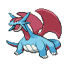
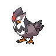
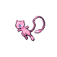

# 🥚 Crianza

## ¿Qué es la Crianza?

* El Sistema de Crianza te permite , que dos Pokémon de la misma especie, o grupo huevo puedan tener una cria, y con ese concepto crear los mejores Pokémon.
* Necesitas tener un PokeRancho, la primera vez.
* Cuando hayas comenzado la primera etapa de crianza, puedes usar un comando para conocer el estado de tus Pokémon en el PokeRancho.
* Puedes tener hasta 3 parejas de Pokémon criando a la vez, al inicio.
* Cada pareja tiene unos requisitos diferentes.
* Debes caminar para abrir los huevos Pokémon.

## Conceptos Basicos de la Crianza.

### Grupo Huevo

El Grupo Huevo es un atributo de los Pokémons que nos ayuda a identificar que Pokémon son compatibles al criar y asi proporcionarnos un huevo Pokémon. Encontraremos Pokémons que puedan pertener a mas de un grupo huevo.

### Clasificación de Grupo Huevo

\-Planta : Estos Pokémons estan vinculados con todo lo que sea vegetal en este grupo de huevo en particular predenomina el tipo planta.

\-Campo : Este es el grupo huevo mas grande 181 Pokémons pertenecen a este encontraremos la mayoria de los mamiferos terrestres.

\-Bicho : En este grupo huevo como su nombre lo dice encontraremos todos los Pokémons tipo bicho y algunos artrópodos.

\-Dragón : En este grupo huevo encontraremos a la mayoria de Pokémons con apariencia de reptil.

\-Agua 1  : Este grupo huevo es el segundo mas grande de Pokémon encontraremos la mayoria de Pokés tipo agua.

\-Agua 2 : En este grupo huevo encontraremos mayormente peces algunos pulpos y cetáceos.

\-Agua 3 : En este grupo huevo encontraremos a la mayoria de Pokés fósiles y crustaceos.

\-Monstrous : En este grupo huevo encontraremos a Pokés cuyas evolucionés son muy grandes.

\-Volador : En este grupo huevo encontraremos a la mayoria de Pokés que sean voladores.

\-Humanoide : En este grupo encontraremos a los Pokés que fisiologia se asemeje a la de un ser Humano.

\-Hada : En este grupo encontraremos Pokés que cuyo aspecto los hacen parecer mas adorables que los demas.

\-Amorfo : En este grupo encontraremos Pokés cuya fisiologia es extraña o indefinida.

\-Mineral : En este grupo encontraremos Pokés cuya composicion puede ser de materiales naturales o artificiales.

\-Desconocido : En este grupo huevo se encuentran los Pokés bebes y todos los legendarios, singulares y el caso especial de ditto.

## Items utilizados en Crianza

Los objetos se eligen al azar, de entre los tipos de los Pokémon a criar.

Ditto tiene sus propios requisitos.
