# 🥚 Crianza

## ¿Qué es la Crianza?

* El Sistema de Crianza te permite , que dos Pokémon de la misma especie, o grupo huevo puedan tener una cria, y con ese concepto crear los mejores Pokémon.
* Necesitas tener un PokeRancho, la primera vez.
* Cuando hayas comenzado la primera etapa de crianza, puedes usar un comando para conocer el estado de tus Pokémon en el PokeRancho.
* Cada pareja tiene unos requisitos diferentes.
* Debes caminar para abrir los huevos Pokémon.

### 🌍 **Mundo Survival - Crianza Clásica (1.12.2)**

En el mundo **Survival**, hemos restaurado la mecánica de crianza clásica basada en el sistema de **Ranch Block y bloques ambientales de las versiones 1.12.2**

#### 🔹 **Cómo funciona**

1. **Uso del Ranch Block**
   * Debes colocar un **Ranch Block** para iniciar la crianza.
   * Existe un maximo de Ranch Block, determinado por tu rango.
2. **Compatibilidad de Pokémon**
   * Dos Pokémon del **mismo Egg Group** pueden criar si son de géneros opuestos o si usas un **Ditto**.
   * La compatibilidad aumenta con el tiempo hasta que estén "enamorados".
3. **Bloques ambientales**
   * Alrededor del Ranch Block, debes colocar **bloques adecuados** para acelerar la crianza.
   * Ejemplo: Para Pokémon tipo Agua, usa bloques como **agua, prismarina o hielo**.
   * Puedes conocer los puntos ambientales, pulsando sobre el Rancho.
4. **Obtención del huevo**
   * Una vez que los Pokémon están listos, un **huevo aparecerá dentro del Ranch Block** y podrás recogerlo.

## 🪐 **Mundo Ikora - Crianza Nueva (1.16.5 con ajustes)**

En el mundo **Ikora**, usamos el sistema de crianza más reciente de **Pixelmon 1.16.5**, pero con algunos ajustes personalizados para mejorar la experiencia.

#### 🔹 **Cómo funciona**

1. **Warp Crianza**
   * En este mundo, **no se usa el Ranch Block**.
   * Debes ir al /warp crianza
   * Existe un máximo de Slots disponibles para Criar.
2. **Sistema de Picnic**
   * Para criar, debes **dejar a los Pokémon en las maquinas alli disponibles**.
   * Los Pokémon necesitan **algunos requisitos para criar**.
3. **Sistema de Gemas**
   * Necesitas usar Gemas de sus tipos, para avanzar en la Crianza.
   * El unico requisito son Gemas de sus tipos.
   * Puedes obtener muchas Gemas cada dia, con nuestro sistema de PokeTrabajos con el comando /pt
4. **Obtención del huevo**
   * Una vez que las fases han terminado, se entrega el Huevo al Jugador.

## Conceptos Basicos de la Crianza.

### Grupo Huevo

El Grupo Huevo es un atributo de los Pokémons que nos ayuda a identificar que Pokémon son compatibles al criar y asi proporcionarnos un huevo Pokémon. Encontraremos Pokémons que puedan pertener a mas de un grupo huevo.

### Clasificación de Grupo Huevo

-Planta : Estos Pokémons estan vinculados con todo lo que sea vegetal en este grupo de huevo en particular predenomina el tipo planta.

-Campo 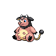: Este es el grupo huevo mas grande 181 Pokémons pertenecen a este encontraremos la mayoria de los mamiferos terrestres.

-Bicho : En este grupo huevo como su nombre lo dice encontraremos todos los Pokémons tipo bicho y algunos artrópodos.

-Dragón 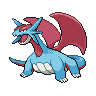: En este grupo huevo encontraremos a la mayoria de Pokémons con apariencia de reptil.

-Agua 1  : Este grupo huevo es el segundo mas grande de Pokémon encontraremos la mayoria de Pokés tipo agua.

-Agua 2 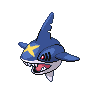: En este grupo huevo encontraremos mayormente peces algunos pulpos y cetáceos.

-Agua 3 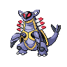: En este grupo huevo encontraremos a la mayoria de Pokés fósiles y crustaceos.

-Monstrous 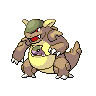: En este grupo huevo encontraremos a Pokés cuyas evolucionés son muy grandes.

-Volador 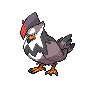: En este grupo huevo encontraremos a la mayoria de Pokés que sean voladores.

-Humanoide 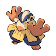: En este grupo encontraremos a los Pokés que fisiologia se asemeje a la de un ser Humano.

-Hada 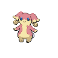: En este grupo encontraremos Pokés que cuyo aspecto los hacen parecer mas adorables que los demas.

-Amorfo 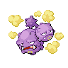: En este grupo encontraremos Pokés cuya fisiologia es extraña o indefinida.

-Mineral 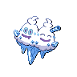: En este grupo encontraremos Pokés cuya composicion puede ser de materiales naturales o artificiales.

-Desconocido 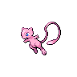: En este grupo huevo se encuentran los Pokés bebes y todos los legendarios, singulares y el caso especial de ditto.

## Items utilizados en Crianza

Los objetos se eligen al azar, de entre los tipos de los Pokémon a criar.

Ditto tiene sus propios requisitos.
